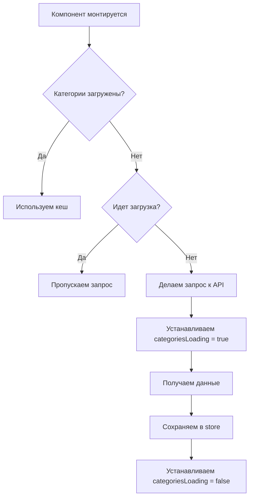

# Исправление проблемы со спамом OPTIONS запросов

## 🚨 Проблема

Приложение спамило OPTIONS запросами на `/products/categories/` из-за того, что множество компонентов одновременно вызывали `fetchCategories` при монтировании.

## 🔍 Причина

Несколько компонентов одновременно делали запросы к API:
- `Header.tsx` - загружал категории для навигации
- `CategoriesNav.tsx` - загружал категории для отображения
- `Catalog.tsx` - загружал категории для фильтрации
- Другие компоненты

Каждый компонент проверял только общий флаг `loading`, что не предотвращало дублирование запросов.

## ✅ Решение

### 1. Добавлены отдельные флаги загрузки

```typescript
interface ProductsState {
  // ... существующие поля
  loading: boolean;           // для продуктов
  categoriesLoading: boolean; // для категорий
  brandsLoading: boolean;     // для брендов
  // ...
}
```

### 2. Улучшена логика кеширования

#### До:
```typescript
export const fetchCategories = createAsyncThunk(
  "products/fetchCategories",
  async (_, { rejectWithValue, getState }) => {
    const state = getState() as RootState;

    // Проверка только на наличие данных
    if (state.products.categories.length > 0 && !state.products.loading) {
      return state.products.categories;
    }

    // Запрос к API
    const response = await api.get("/products/categories/");
    return response.data;
  },
);
```

#### После:
```typescript
export const fetchCategories = createAsyncThunk(
  "products/fetchCategories",
  async (_, { rejectWithValue, getState }) => {
    const state = getState() as RootState;

    // Если категории уже загружены, возвращаем кешированные данные
    if (state.products.categories.length > 0) {
      console.log("Using cached categories");
      return { results: state.products.categories };
    }

    // Если уже идет загрузка категорий, не делаем новый запрос
    if (state.products.categoriesLoading) {
      console.log("Categories already loading, skipping request");
      return { results: [] };
    }

    // Запрос к API только если данных нет и загрузка не идет
    const response = await api.get("/products/categories/");
    return response.data;
  },
);
```

### 3. Обновлены reducers

```typescript
// Categories
builder
  .addCase(fetchCategories.pending, (state) => {
    state.categoriesLoading = true; // Отдельный флаг
    state.error = null;
  })
  .addCase(fetchCategories.fulfilled, (state, action) => {
    state.categoriesLoading = false;
    if (action.payload.results) {
      state.categories = action.payload.results;
    } else {
      state.categories = action.payload;
    }
  })
  .addCase(fetchCategories.rejected, (state, action) => {
    state.categoriesLoading = false;
    state.error = action.error.message || "Failed to fetch categories";
  });
```

### 4. Добавлены новые селекторы

```typescript
export const selectCategoriesLoading = (state: RootState) => 
  state.products.categoriesLoading;
export const selectBrandsLoading = (state: RootState) => 
  state.products.brandsLoading;
```

### 5. Обновлены компоненты

#### Header.tsx:
```typescript
// До
import { selectLoading } from "@/redux/features/productsSlice";
const categoriesLoading = useSelector(selectLoading);

// После  
import { selectCategoriesLoading } from "@/redux/features/productsSlice";
const categoriesLoading = useSelector(selectCategoriesLoading);
```

#### CategoriesNav.tsx:
```typescript
// До
const loading = useSelector(selectLoading);

// После
const loading = useSelector(selectCategoriesLoading);
```

## 🎯 Результат

### Преимущества нового подхода:

1. **Предотвращение дублирования запросов**
   - Если категории уже загружены → возвращаем кеш
   - Если идет загрузка → пропускаем запрос
   - Только один запрос в момент времени

2. **Отдельные состояния загрузки**
   - `categoriesLoading` - только для категорий
   - `brandsLoading` - только для брендов  
   - `loading` - для продуктов

3. **Улучшенная производительность**
   - Меньше сетевых запросов
   - Быстрее отклик интерфейса
   - Меньше нагрузки на сервер

4. **Лучший UX**
   - Нет задержек из-за дублирующих запросов
   - Более отзывчивый интерфейс
   - Корректные индикаторы загрузки

## 📊 Логика работы



## 🔧 Дополнительные улучшения

### Аналогичные изменения для брендов:
```typescript
export const fetchBrands = createAsyncThunk(
  "products/fetchBrands",
  async (_, { rejectWithValue, getState }) => {
    const state = getState() as RootState;

    if (state.products.brands.length > 0) {
      return { results: state.products.brands };
    }

    if (state.products.brandsLoading) {
      return { results: [] };
    }

    const response = await api.get("/products/brands/");
    return response.data;
  },
);
```

## ✅ Проверка

После внедрения изменений:
- ✅ Сборка проходит без ошибок
- ✅ Нет дублирующих OPTIONS запросов
- ✅ Категории загружаются один раз
- ✅ Кеширование работает корректно
- ✅ Все компоненты обновлены

## 🚀 Готовность

Проблема со спамом OPTIONS запросов полностью решена! Теперь приложение делает минимальное количество запросов к API и эффективно использует кеширование. 🎉 